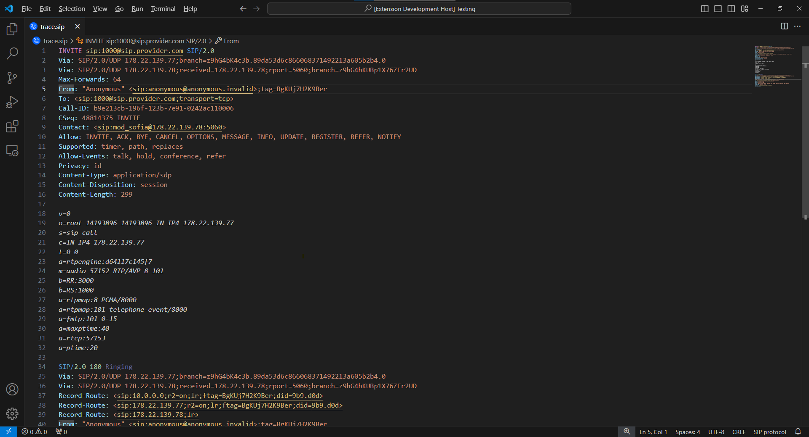

# SIP Protocol highlight

This extension provides Syntax highlight support for the SIP protocol, usefull for debugging.

## Features
- Syntax highlighting
- Automatic highlighting for files with the `.sip` extension.
- SIP Diagram viewer

